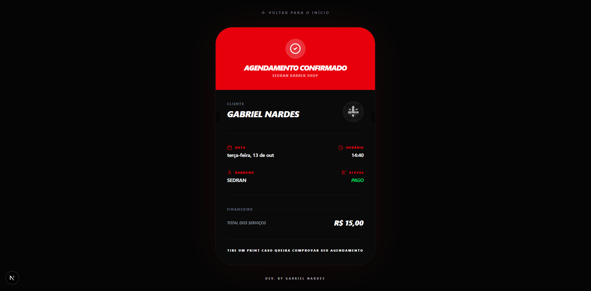
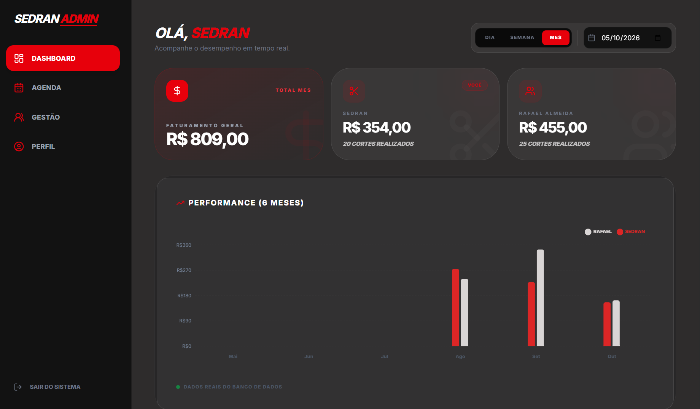

# Sedran Barber Shop

**MVP full stack para gerenciamento de barbearias**, desenvolvido como projeto de portfólio com foco em **agendamentos, pagamentos online e gestão administrativa**.

O projeto simula a operação digital de uma barbearia, conectando o fluxo do cliente ao gerenciamento interno da operação, incluindo **agendamento, pagamento via Pix, confirmação por webhook e dashboard administrativo**.

> **Status:** MVP funcional desenvolvido para portfólio.

### Demonstração online

**[Acessar o Sedran Barber Shop](https://sedran-barber-shop.vercel.app/)**

---

## Preview


---

##  Fluxo da aplicação


O MVP implementa o seguinte fluxo principal:

```text
Cliente
   │
   ▼
Escolha do serviço
   │
   ▼
Seleção do horário
   │
   ▼
Criação do agendamento
   │
   ▼
Pagamento via Pix
   │
   ▼
Mercado Pago
   │
   ▼
Webhook
   │
   ▼
Confirmação do pagamento
   │
   ▼
Atualização do agendamento
   │
   ▼
Dashboard administrativo
```

---

## Funcionalidades

### Agendamentos

O sistema suporta dois fluxos de agendamento:

**Agendamento pelo cliente**

* Seleção de serviços.
* Seleção de horários disponíveis.
* Validação de disponibilidade.
* Criação do agendamento.
* Pagamento via Pix.
* Confirmação automática após processamento do pagamento.

**Agendamento pelo barbeiro**

O barbeiro também pode registrar um agendamento diretamente pelo dashboard administrativo, permitindo atender clientes que estejam presencialmente na barbearia ou que não tenham acesso à internet.

Nesse fluxo, o agendamento é criado diretamente pelo barbeiro e **não passa pelo pagamento via Pix**, permitindo registrar atendimentos presenciais ou outras situações em que o pagamento online não seja necessário.

Ambos os fluxos utilizam as mesmas regras de disponibilidade, evitando conflitos de horário.


### Pagamentos

Integração com o **Mercado Pago** para processamento de pagamentos via Pix.

O fluxo utiliza:

* Criação do checkout.
* Pagamento via Pix.
* Recebimento de notificações.
* Processamento de webhooks.
* Atualização automática do status do agendamento.

A confirmação não depende do cliente permanecer na página após realizar o pagamento. O sistema utiliza o webhook enviado pelo provedor para processar a confirmação da transação.



### Dashboard administrativo

Área protegida para gerenciamento da operação da barbearia.

Inclui:

* Visualização da agenda.
* Acompanhamento dos agendamentos.
* Métricas de faturamento.
* Ticket médio.
* Controle dos pagamentos.



---

## Arquitetura

A aplicação utiliza o **Next.js App Router**, distribuindo responsabilidades entre interface, regras de negócio, persistência de dados e integrações externas.

### Server Components

Server Components são utilizados nas partes da aplicação que não precisam de interatividade no navegador.

Isso permite executar a obtenção de dados no servidor e reduzir a quantidade de JavaScript enviada ao cliente.

### Server Actions

As principais mutações internas utilizam Server Actions, evitando a necessidade de criar endpoints REST para operações que não precisam ser expostas como uma API pública.

### Webhooks

O processamento dos pagamentos utiliza webhooks do Mercado Pago.

Esse modelo permite que a confirmação da transação seja processada de forma independente do estado da página do cliente.

---

##  Stack

| Categoria      | Tecnologia                       |
| -------------- | -------------------------------- |
| Framework      | Next.js 14                       |
| Linguagem      | TypeScript                       |
| Interface      | React + Tailwind CSS + shadcn/ui |
| Backend        | Next.js Server Actions           |
| Banco de dados | PostgreSQL                       |
| ORM            | Prisma                           |
| Infraestrutura | Supabase                         |
| Autenticação   | Auth.js                          |
| Pagamentos     | Mercado Pago                     |
| Deploy         | Vercel                           |

---

## Persistência de dados

O projeto utiliza **PostgreSQL** com **Prisma ORM**.

O banco foi modelado para representar as principais entidades e relações do domínio da barbearia, mantendo integridade relacional e acesso tipado aos dados através do Prisma.

Para o ambiente serverless utilizado no deploy, a aplicação utiliza **connection pooling**, reduzindo problemas relacionados à abertura excessiva de conexões com o banco.

---

## Autenticação e segurança

A área administrativa possui autenticação e controle de acesso.

Entre as medidas utilizadas:

* Auth.js para autenticação.
* Proteção das áreas administrativas.
* Operações sensíveis executadas no servidor.
* Senhas armazenadas de forma segura.
* Validação dos dados antes das mutações.
* Credenciais e tokens armazenados em variáveis de ambiente.
* Segredos de produção fora do código-fonte.

---

## Principais decisões técnicas

### Server Components + Server Actions

A aplicação aproveita os recursos do Next.js para executar lógica no servidor e reduzir a necessidade de uma API REST tradicional para operações internas.

### PostgreSQL + Prisma

O domínio possui relacionamentos entre diferentes entidades, tornando o modelo relacional adequado para garantir consistência dos dados.

O Prisma adiciona tipagem ao acesso ao banco e facilita a manutenção do schema.

### Mercado Pago + Webhooks

O pagamento possui comportamento assíncrono.

Por isso, a aplicação não considera a resposta inicial do checkout como única fonte de verdade. A confirmação da transação é processada através do webhook enviado pelo provedor de pagamento.

---

## O que este projeto demonstra

O projeto foi desenvolvido para aprofundar conhecimentos práticos em:

* Desenvolvimento full stack.
* Next.js App Router.
* Server Components.
* Server Actions.
* TypeScript.
* Modelagem de bancos relacionais.
* Prisma ORM.
* PostgreSQL.
* Autenticação.
* Integração com APIs externas.
* Webhooks.
* Processamento de pagamentos.
* Arquitetura serverless.
* Deploy e configuração de produção.

---

## Possíveis evoluções

Como MVP, o projeto pode evoluir futuramente com funcionalidades como:

* Gestão de múltiplos barbeiros.
* Cancelamento e reagendamento.
* Histórico de clientes.
* Notificações automáticas.
* Relatórios financeiros avançados.
* Gestão de serviços pelo dashboard.
* Métricas de desempenho por período.
* Outros meios de pagamento.

---

## Autor

Desenvolvido por **Gabriel Nardes (Sedran)** como projeto de portfólio para demonstrar conhecimentos em desenvolvimento full stack e construção de aplicações web orientadas a regras de negócio.

### Tecnologias

`Next.js` · `TypeScript` · `React` · `PostgreSQL` · `Prisma` · `Supabase` · `Auth.js` · `Mercado Pago` · `Tailwind CSS`

---

### Demonstração

**[Acessar o Sedran Barber Shop](https://sedran-barber-shop.vercel.app/)**
